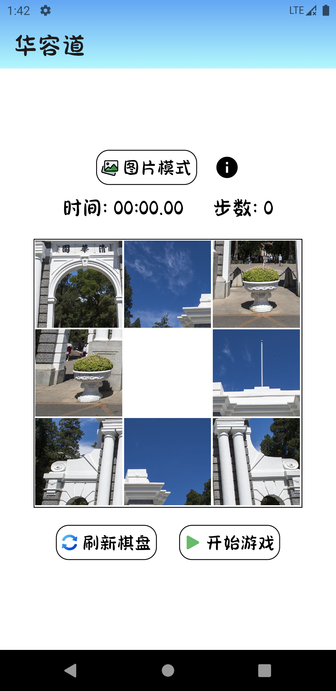
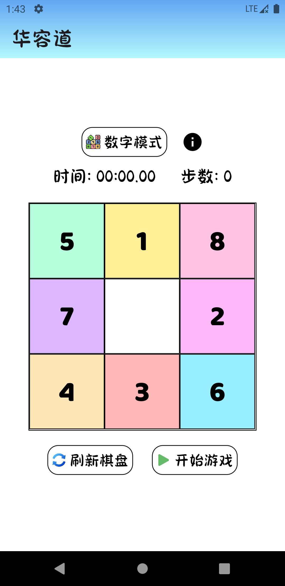
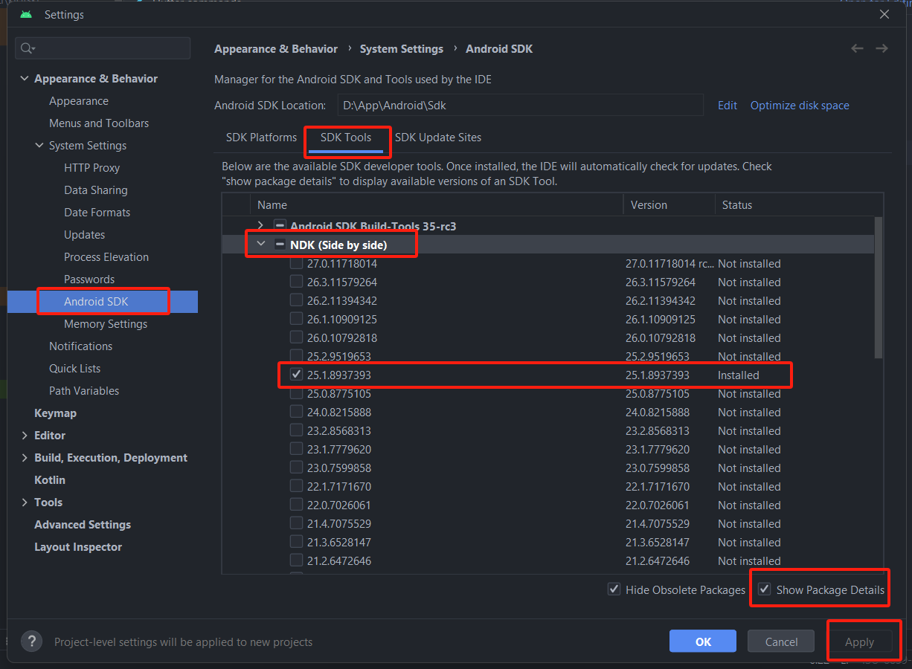
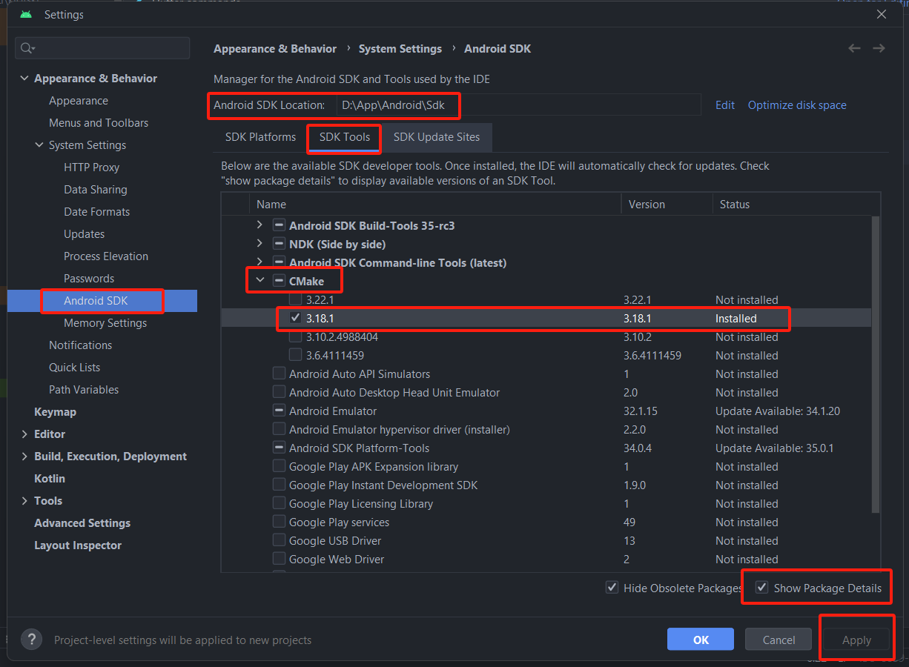

# klotski 

**AI数字-图片3*3华容道**

下载连接 https://cloud.tsinghua.edu.cn/f/7d2d3e630d384960a9ba/





## bug解决

- `awesome_dialog` 依赖问题 

  ```yaml
  # pubspec.yaml
  
  dependencies:
      ...
    awesome_dialog: ^3.1.0
    simple_animations: ^5.0.2 # 需要添加这个
  
  dependency_overrides:
    simple_animations: ^5.0.2 # 还有这个
  ```

  打开 `android studio`

  - 随便打开一个项目于

  - 点击 `Tools -> SDK Manager`  

  - 点击 `SDK Tools` ，右下角 `Show Packages Details` 勾选

  - **切记配置好代理等，否则网络不佳无法看到下面的选项，而只看得到那些已经安装的**

  - 找 `NDK (Side By Side)`，勾选`25.1.8937393`，点击 `apply`，安装，`D:\\App\\Android\\Sdk\\ndk\\25.1.8937393` 目录下就有很多文件了

  - 

  - 找 `CMake` ，勾选 `3.18.1`，点击 `apply`，安装

  - 

    

  `build.gradle` 中，替换 `ndk` 版本

  ```gradle
  // ProjectName\android\app\build.gradle
  
  android {
  	...
      // ndkVersion flutter.ndkVersion
      ndkVersion "25.1.8937393" 
  ```

  

  `local.properties`中，添加 `ndk.dir`

  ```properties
  // ProjectName\android\local.properties
  
  sdk.dir=D:\\App\\Android\\Sdk
  ndk.dir=D:\\App\\Android\\Sdk\\ndk\\25.1.8937393
  flutter.sdk=D:\\App\\Flutter\\flutter_windows_3.3.0-stable\\flutter
  flutter.buildMode=release
  flutter.versionName=1.0.0
  flutter.versionCode=1
  ```

  

